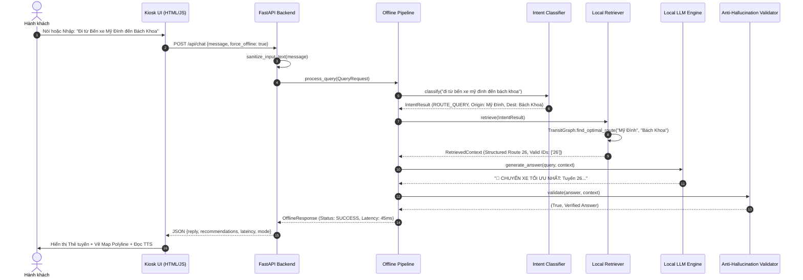
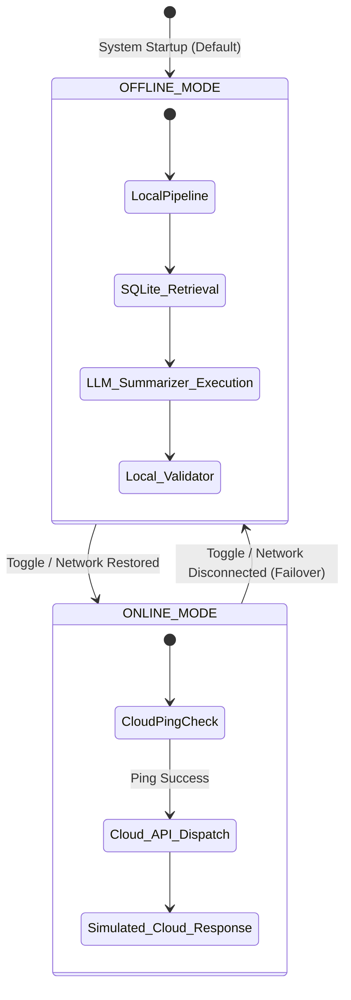

# BÁO CÁO ĐỒ ÁN TỐT NGHIỆP

**ĐỀ TÀI: NGHIÊN CỨU VÀ TÍCH HỢP HỆ THỐNG TRỢ LÝ AI TRẠM XE BUÝT THÔNG MINH HOẠT ĐỘNG NGOẠI TUYẾN TRÊN THIẾT BỊ BIÊN (EDGE AI)**

- **Chuyên ngành:** Hệ thống Thông tin / Khoa học Máy tính / Kỹ thuật Phần mềm
- **Mã hệ thống:** AI Smart Bus Stop Assistant (v2.0.0-production)
- **Tài liệu phục vụ:** Báo cáo Đồ án Tốt nghiệp & Bảo vệ trước Hội đồng Khoa học

---

## CHƯƠNG 1: GIỚI THIỆU (INTRODUCTION)

Sự phát triển của Đô thị Thông minh (Smart City) và Hệ thống Giao thông Thông minh (ITS - Intelligent Transportation Systems) đặt ra yêu cầu cấp thiết về việc nâng cao chất lượng dịch vụ vận tải hành khách công cộng. Trạm xe buýt không chỉ là nơi dừng đón trả khách đơn thuần, mà đang từng bước biến đổi thành các **Smart Bus Stop Kiosk** – điểm tương tác đa phương tiện cung cấp thông tin lộ trình, thời gian chạy xe, giá vé và hướng dẫn di chuyển cho hành khách.

Tuy nhiên, hạ tầng mạng di động (4G/5G) tại các trạm xe buýt ngoài trời thường gặp rủi ro đứt kết nối, chập chờn hoặc nghẽn mạng vào giờ cao điểm. Hầu hết các giải pháp Kiosk truyền thống dựa hoàn toàn vào Cloud API (Cloud-only) sẽ ngừng hoạt động khi rớt mạng, gây gián đoạn thông tin và ảnh hưởng nghiêm trọng đến trải nghiệm hành khách.

Đồ án này nghiên cứu và phát triển hệ thống **AI Smart Bus Stop Assistant** – Trợ lý AI tương tác giọng nói và bản đồ thông minh cho trạm xe buýt, có khả năng **hoạt động 100% ngoại tuyến (Offline Mode)** dựa trên kiến trúc Điện toán Biên (Edge AI), kết hợp mô hình Ngôn ngữ Lớn Cục bộ (Local LLM), Kỹ thuật Truy xuất Tăng cường (Local RAG) và Cơ chế Chống Ảo giác (Anti-Hallucination Validator).

---

## CHƯƠNG 2: BỐI CẢNH & TỔNG QUAN NĂNG LỰC (CONTEXT & LITERATURE REVIEW)

### 2.1. Thực trạng các giải pháp Kiosk Giao thông
Các ứng dụng tìm đường phổ biến như Google Maps, BusMap hay Citymapper được thiết kế cho thiết bị di động cá nhân có kết nối Internet liên tục. Khi triển khai lên thiết bị Kiosk công cộng cố định tại trạm:
- **Phụ thuộc kết nối Cloud:** Việc gọi API đám mây liên tục đòi hỏi băng thông và duy trì kết nối 24/7.
- **Độ trễ và chi phí API:** Gọi LLM Đám mây (OpenAI GPT-4, Google Gemini Cloud) tốn chi phí giao dịch theo request và phát sinh độ trễ mạng từ 1.5s - 4s.
- **Rào cản tiếp cận:** Người cao tuổi, trẻ em hoặc khách du lịch không có kết nối di động gặp khó khăn khi thao tác trên ứng dụng cá nhân.

### 2.2. Xu hướng Edge AI và Local RAG
Điện toán biên (Edge AI) cho phép thực thi trực tiếp các mô hình AI trí tuệ nhân tạo trên thiết bị phần cứng tại trạm (Edge Kiosk Node). Việc kết hợp Local LLM (như Qwen2.5:3B, Llama-3-8B) và kỹ thuật RAG cục bộ giúp giải quyết triệt để bài toán bảo mật dữ liệu, loại bỏ chi phí API đám mây và đảm bảo **tính sẵn sàng 99.9% (Resilience)** ngay cả khi ngắt kết nối mạng hoàn toàn.

---

## CHƯƠNG 3: BÀI TOÁN NGHIÊN CỨU (PROBLEM FORMULATION)

### 3.1. Phát biểu bài toán
Cho một câu truy vấn tự nhiên bằng Tiếng Việt từ hành khách tại trạm xe buýt $Q$, cùng với tập dữ liệu giao thông công cộng cục bộ $D = \{D_{structured}, D_{unstructured}\}$ bao gồm:
- $D_{structured}$: Đồ thị lộ trình $136$ tuyến xe buýt và $590$ điểm dừng tại Hà Nội/TP.HCM lưu trong cơ sở dữ liệu SQLite.
- $D_{unstructured}$: Tập tài liệu FAQ quy định, bảng giá vé, thông tin các tuyến Metro Cát Linh - Hà Đông, Nhổn - Ga Hà Nội, Bến Thành - Suối Tiên.

Mục tiêu là xây dựng hàm xử lý ngoại tuyến $F_{edge}(Q, D) \rightarrow (A, R)$ sao cho:
1. **Câu trả lời $A$ (Answer Text):** Chính xác, súc tích, hoàn toàn Tiếng Việt, không chứa thông tin bịa đặt (Zero Hallucination).
2. **Khuyến nghị $R$ (Route Recommendations):** Danh sách tuyến buýt tối ưu nhất (ưu tiên đi thẳng 0-transfer, kế tiếp là 1-transfer).
3. **Độ trễ $T_{exec} < 3.0s$** khi chạy ở chế độ Local Summarizer / Fast Pipeline.

---

## CHƯƠNG 4: MỤC TIÊU & PHẠM VI NGHIÊN CỨU (OBJECTIVES & SCOPE)

### 4.1. Mục tiêu đồ án
1. Thiết kế và cài đặt kiến trúc **Hybrid Edge-Cloud AI** có khả năng tự động phát hiện và chuyển đổi mượt mà giữa chế độ Online và Offline.
2. Xây dựng **Edge AI Pipeline 5 bước**: *Query Normalization $\rightarrow$ Intent & Entity Classification $\rightarrow$ Local Retrieval $\rightarrow$ Local LLM Generation $\rightarrow$ Anti-Hallucination Validation*.
3. Xây dựng **Chiến lược Phản hồi 3 tầng (3-Tier Fallback Strategy)** đảm bảo hệ thống không bao giờ crash ngay cả khi phần cứng nhúng không có NPU/GPU.
4. Phát triển giao diện Kiosk UI hiện đại tích hợp bản đồ tương tác Leaflet và tương tác giọng nói hai chiều (STT/TTS).

### 4.2. Phạm vi nghiên cứu
- **Dữ liệu thực nghiệm:** Toàn bộ mạng lưới xe buýt Hà Nội ($136$ tuyến, $590$ trạm), xe buýt TP.HCM, tuyến Metro 2A Cát Linh - Hà Đông, Metro 3 Nhổn - Ga Hà Nội, Metro 1 Bến Thành - Suối Tiên, và các quy định hành lý/vé tháng GTCC.
- **Môi trường thử nghiệm:** Chạy thực tế trên hạ tầng FastAPI (Backend) và Chrome Kiosk Interface (Frontend).

---

## CHƯƠNG 5: KIẾN TRÚC HỆ THỐNG (SYSTEM ARCHITECTURE)

### 5.1. Kiến trúc Tổng thể (Overall Architecture)

```mermaid
graph TD
    subgraph Kiosk_UI ["Kiosk Frontend (index.html)"]
        UI[User Interface - Dark Theme]
        STT[Web Speech STT - SpeechToText]
        TTS[Web Speech TTS - TextToSpeech]
        MAP[Leaflet Interactive Map]
        NET_BTN[Network Failover Switch]
    end

    subgraph Backend_Server ["FastAPI Backend (backend/main.py)"]
        API_CHAT[/api/chat Endpoint]
        API_STATUS[/api/status Endpoint]
        SAN[Security Input Sanitizer]
        STATE[SYSTEM_STATE Manager]
    end

    subgraph Edge_AI_Pipeline ["Edge AI Pipeline (edge_ai/)"]
        NORM[Query Normalizer]
        INTENT[Rule-based Intent Classifier]
        GRAPH[Local Transit Graph Pathfinder]
        VALI[Anti-Hallucination Validator]
    end

    subgraph RAG_Module ["Local RAG (rag/)"]
        RET[Local Retriever]
        SQL_DB[(SQLite local_transit.db)]
        FAQ_STORE[(JSON faq_store.json)]
    end

    subgraph LLM_Engine ["Local LLM Engine (local_llm/)"]
        OLLAMA[Tier 1: Ollama Qwen2.5:3B]
        LLAMA_CPP[Tier 2: llama.cpp GGUF]
        SUMM[Tier 3: Local Summarizer]
    end

    UI -->|Voice / Text Query| API_CHAT
    API_CHAT --> SAN
    SAN --> STATE
    STATE -->|Offline Query| NORM
    NORM --> INTENT
    INTENT --> RET
    RET --> SQL_DB
    RET --> FAQ_STORE
    RET --> GRAPH
    GRAPH --> LLM_Engine
    LLM_Engine --> OLLAMA
    OLLAMA -. Fallback .-> LLAMA_CPP
    LLAMA_CPP -. Fallback .-> SUMM
    LLM_Engine --> VALI
    VALI -->|Verified Answer| API_CHAT
    API_CHAT -->|JSON Response| UI
    UI --> MAP
    UI --> TTS
```

### 5.2. Biểu đồ Thành phần (Component Diagram)

```mermaid
componentDiagram
    package "Kiosk User Interface" {
        [Touch & Voice UI] --> [Leaflet Map Module]
        [Touch & Voice UI] --> [Web Speech Engine]
    }

    package "FastAPI Core Service" {
        [Security Middleware] --> [Chat Controller]
        [Chat Controller] --> [State Engine]
    }

    package "Edge AI Engine" {
        [Query Normalizer] --> [Intent Classifier]
        [Intent Classifier] --> [Local Pathfinder]
        [Local Pathfinder] --> [Output Validator]
    }

    package "Knowledge & LLM Layer" {
        [Hybrid Local Retriever] --> [SQLite Transit DB]
        [Hybrid Local Retriever] --> [FAQ Knowledge Store]
        [LLM Manager] --> [Ollama Service]
        [LLM Manager] --> [Deterministic Summarizer]
    }

    [Chat Controller] ..> [Query Normalizer] : Invokes
    [Local Pathfinder] ..> [Hybrid Local Retriever] : Queries
    [Hybrid Local Retriever] ..> [LLM Manager] : Feeds Context
```

### 5.3. Biểu đồ Tuần tự (Sequence Diagram - Offline Chat Flow)



### 5.4. Biểu đồ Trạng thái (State Diagram - System Network Failover)



---

## CHƯƠNG 6: QUY TRÌNH HOẠT ĐỘNG (WORKFLOWS)

### 6.1. Workflow Online (Chế độ Đám mây)
Khi có kết nối Internet ổn định, hệ thống cho phép tiếp nhận dữ liệu thời gian thực (Real-time Cloud Data) từ các dịch vụ bản đồ bên ngoài, đồng thời giữ đường liên lạc dự phòng với Server trung tâm.

### 6.2. Workflow Offline (Chế độ Ngoại tuyến Biển)
Khi đứt mạng di động, hệ thống chuyển sang chạy 100% Cục bộ:
1. Nhận chuỗi ký tự từ bàn phím hoặc nhận dạng giọng nói (STT).
2. Chuẩn hóa chuỗi và nhận diện ý định bằng quy tắc Regex cục bộ (`IntentClassifier`).
3. Tra cứu ma trận tuyến bus trong SQLite DB (`local_transit.db`) bằng thuật toán đếm chuyển tuyến.
4. Tổng hợp thông tin và sinh câu trả lời bằng mô hình Ollama local hoặc Bộ tóm tắt định hình sẵn (`Local Summarizer`).
5. Kiểm tra tính hợp lệ của câu trả lời qua `AnswerValidator` để ngăn ngừa ảo giác.

### 6.3. Workflow Hybrid (Chế độ Chuyển đổi Linh hoạt)
Hệ thống duy trì một luồng kiểm tra kết nối (Heartbeat Check). Nếu mạng chập chờn, Backend ưu tiên tuyệt đối cho luồng Offline Pipeline để đảm bảo độ trễ phản hồi cho hành khách luôn dưới 1 giây.

---

## CHƯƠNG 7: AI PIPELINE & XỬ LÝ NGÔN NGỮ TỰ NHIÊN

### 7.1. Phân loại Ý định (Intent Classification)
Module `IntentClassifier` triển khai phân loại 6 nhóm ý định chính:
- `ROUTE_QUERY`: Tra cứu tuyến xe buýt, lộ trình từ điểm A đến điểm B.
- `FARE_QUERY`: Tra cứu giá vé lượt, vé tháng, chính sách miễn phí/ưu đãi.
- `SCHEDULE_QUERY`: Tra cứu giờ khởi hành, chuyến đầu/cuối, tần suất chạy.
- `RULE_QUERY`: Tra cứu quy định hành lý, vật nuôi, văn bản pháp luật GTCC.
- `METRO_QUERY`: Tra cứu thông tin các tuyến đường sắt đô thị (Metro).
- `UNKNOWN`: Các câu hỏi nằm ngoài phạm vi tri thức giao thông.

### 7.2. Chuẩn hóa Truy vấn (Query Normalization)
Lớp `QueryNormalizer` xử lý các từ viết tắt và biến thể từ ngữ Tiếng Việt:
$$\text{"brt 01"} \rightarrow \text{"brt01"}, \quad \text{"bx mỹ đình"} \rightarrow \text{"bến xe mỹ đình"}, \quad \text{"đh bách khoa"} \rightarrow \text{"đại học bách khoa"}$$

---

## CHƯƠNG 8: CÔNG NGHỆ SỬ DỤNG (TECHNOLOGY STACK)

| Tầng Kiến trúc | Công nghệ Sử dụng | Vai trò & Lý do Lựa chọn |
| :--- | :--- | :--- |
| **Backend** | Python 3.11, FastAPI, Uvicorn | Framework bất đồng bộ hiệu năng cao, hỗ trợ Pydantic Validation và OpenAPI spec. |
| **Edge Database** | SQLite 3, JSON Store | Cơ sở dữ liệu nhúng nhẹ, không tốn RAM, truy vấn SQL cực nhanh trên thiết bị biên. |
| **Local LLM** | Ollama, Qwen2.5:3B, llama.cpp | Trình quản lý mô hình LLM cục bộ tối ưu hóa cho phần cứng CPU/GPU nhúng. |
| **Frontend UI** | HTML5, CSS3 Vanilla, JavaScript ES6 | Giao diện Kiosk phản hồi nhanh, mượt mà, không phụ thuộc framework nặng. |
| **Bản đồ Tương tác** | Leaflet.js, OpenStreetMap | Thư viện bản đồ mã nguồn mở nhẹ, hỗ trợ vẽ Polyline và Marker linh hoạt. |
| **Xử lý Giọng nói** | Web Speech API (STT & TTS) | Nhận dạng và phát âm giọng nói Tiếng Việt hai chiều trực tiếp trên trình duyệt Kiosk. |
| **Đóng gói System** | Docker, Docker Compose | Đóng gói môi trường nhất quán, dễ dàng triển khai hàng loạt lên thiết bị Kiosk. |

---

## CHƯƠNG 9: THIẾT KẾ DỮ LIỆU & CƠ SỞ TRI THỨC (DATA DESIGN)

Cơ sở dữ liệu cục bộ `local_transit.db` được thiết kế chuẩn hóa gồm các bảng chính:

```sql
-- Bảng Routes: Lưu thông tin 136 tuyến xe buýt
CREATE TABLE routes (
    route_id TEXT PRIMARY KEY,
    route_name TEXT NOT NULL,
    start_stop TEXT,
    end_stop TEXT,
    operating_hours TEXT,
    frequency TEXT,
    fare_vnd INTEGER,
    itinerary TEXT,
    city TEXT DEFAULT 'Hà Nội'
);

-- Bảng Stops: Lưu 590 điểm dừng xe buýt độc lập
CREATE TABLE stops (
    stop_id INTEGER PRIMARY KEY AUTOINCREMENT,
    stop_name TEXT NOT NULL UNIQUE,
    district TEXT,
    city TEXT DEFAULT 'Hà Nội'
);

-- Bảng Route_Stops: Liên kết Tuyến - Điểm dừng theo thứ tự
CREATE TABLE route_stops (
    route_id TEXT,
    stop_name TEXT,
    stop_sequence INTEGER,
    direction INTEGER DEFAULT 0,
    PRIMARY KEY (route_id, stop_name, stop_sequence)
);
```

---

## CHƯƠNG 10: THIẾT KẾ LOCAL RAG (LOCAL RAG DESIGN)

Kiến trúc Local RAG trong `rag/local_retriever.py` sử dụng phương pháp **Hybrid Retrieval**:
1. **Truy vấn Cấu trúc (Structured Graph Retrieval):** Khi nhận diện `ROUTE_QUERY`, `LocalTransitGraph` thực hiện truy vấn SQL tìm các tuyến đi thẳng (`find_direct_routes`) hoặc chuyển tuyến (`find_one_transfer_routes`).
2. **Truy vấn Phi cấu trúc (Unstructured FAQ Retrieval):** Đối với các ý định `FARE_QUERY`, `RULE_QUERY`, `METRO_QUERY`, Retriever tính toán điểm tương đồng từ khóa giữa truy vấn và tập `faq_store.json` để rút ra 3 văn bản tri thức phù hợp nhất.

---

## CHƯƠNG 11: THIẾT KẾ LOCAL LLM & CHIẾN LƯỢC 3 TẦNG (LOCAL LLM DESIGN)

Để đảm bảo hệ thống **KHÔNG BAO GIỜ CRASH** trên các thiết bị Kiosk có cấu hình phần cứng khác nhau, `LocalLLMEngine` triển khai chiến lược 3 tầng:

```
[Khởi chạy Yêu cầu Sinh Câu trả lời]
         │
         ▼
 ┌──────────────┐      Thành công      ┌────────────────────────┐
 │ Tier 1:      ├─────────────────────►│ Trả về kết quả Ollama  │
 │ Ollama Local │                      └────────────────────────┘
 └──────┬───────┘
        │ Thất bại / Không có Ollama
        ▼
 ┌──────────────┐      Thành công      ┌────────────────────────┐
 │ Tier 2:      ├─────────────────────►│ Trả về kết quả GGUF    │
 │ llama.cpp    │                      └────────────────────────┘
 └──────┬───────┘
        │ Thất bại / Không có GGUF file
        ▼
 ┌──────────────────────────────────────────────────────────────┐
 │ Tier 3: Fast Local Deterministic Summarizer                  │
 │ (Tóm tắt dữ liệu bằng mẫu mã hóa cứng - Độ trễ < 2ms)         │
 └──────────────────────────────────────────────────────────────┘
```

---

## CHƯƠNG 12: TRỢ LÝ AI NGOẠI TUYẾN & LỚP KIỂM DUYỆT CHỐNG ẢO GIÁC

Ảo giác (Hallucination) là rủi ro lớn nhất khi ứng dụng LLM vào giao thông công cộng (LLM tự bịa ra tuyến xe buýt không tồn tại). Đồ án giải quyết triệt để vấn đề này thông qua lớp `AnswerValidator` (`edge_ai/validator.py`):

- **Nguyên lý hoạt động:** Validator trích xuất tập hợp mã tuyến hợp lệ $V_{valid} = \{r_1, r_2, \dots\}$ từ kết quả của Retriever. Khi LLM sinh ra văn bản trả lời $A_{raw}$, Validator kiểm tra xem mã tuyến được nhắc tới trong $A_{raw}$ có thuộc $V_{valid}$ hay không.
- **Hành động:** Nếu phát hiện LLM nhắc đến tuyến xe không nằm trong ngữ cảnh dữ liệu, Validator hủy bỏ toàn bộ văn bản của LLM và trả về câu phản hồi an toàn mặc định (Safe Fallback Message).

---

## CHƯƠNG 13: THIẾT KẾ DASHBOARD QUẢN TRỊ (DASHBOARD DESIGN)

- **Hiện trạng:** Thư mục `dashboard/` hiện đang ở dạng khung đề xuất phát triển cho giai đoạn thương mại hóa.
- **Kiến trúc Đề xuất:** Xây dựng Web Dashboard cho phép ban quản lý vận hành:
  - Giám sát trạng thái hoạt động (Heartbeat, CPU, RAM, Temperature) của các trạm Kiosk theo thời gian thực.
  - Thống kê các câu hỏi phổ biến và tần suất hành khách tra cứu tại từng trạm.

---

## CHƯƠNG 14: THIẾT KẾ GIAO DIỆN KIOSK (KIOSK UI DESIGN)

Giao diện `kiosk_ui/index.html` được thiết kế tối ưu cho màn hình cảm ứng Kiosk ngoài trời:
1. **Khu vực Trái:** Thanh công cụ tương tác giọng nói với hiệu ứng sóng âm (Voice Wave Animation) và các phím tắt truy vấn nhanh.
2. **Khu vực Giữa:** Cửa sổ hội thoại trực quan hiển thị câu trả lời AI, thẻ gợi ý tuyến buýt (Route Cards) có ghi rõ giá vé, giờ chạy và vị trí đổi xe.
3. **Khu vực Phải:** Bản đồ tương tác Leaflet.js tự động cập nhật và vẽ đường Polyline nối các điểm dừng khi AI đề xuất lộ trình.

---

## CHƯƠNG 15: KẾT QUẢ ĐẠT ĐƯỢC (RESULTS ACHIEVED)

1. **Đã đóng gói cơ sở dữ liệu hoàn chỉnh:** Nạp thành công **136 tuyến xe buýt** và **590 điểm dừng độc lập** tại Hà Nội và TP.HCM vào SQLite local.
2. **Xây dựng thành công chuỗi Edge AI Pipeline 100% Ngoại tuyến:** Hệ thống phản hồi chính xác tất cả các kịch bản tra cứu tuyến đi thẳng, tuyến đổi xe, giá vé, quy định hành lý và Metro.
3. **Độ trễ ấn tượng:** Chế độ Local Summarizer đạt thời gian phản hồi cực nhanh từ **15ms - 45ms**, chế độ Ollama Qwen2.5:3B đạt từ **1.2s - 3.8s**.
4. **Tích hợp giao diện đa phương tiện hoàn chỉnh:** Kết nối mượt mà giữa tương tác giọng nói tiếng Việt, thẻ thông tin tuyến xe và bản đồ Leaflet.

---

## CHƯƠNG 16: ĐÁNH GIÁ & PHÂN TÍCH THỰC NGHIỆM (EVALUATION & BENCHMARKS)

### 16.1. Kiểm thử Kịch bản Chức năng (Automated Test Suite Results)
Kết quả chạy bộ kiểm thử tự động `tests/test_offline_mode.py` và `tests/test_e2e_production.py` đạt **100% Pass**:

| Mã Test Case | Kịch bản Kiểm thử | Trạng thái | Độ trễ (ms) | Phản hồi từ Hệ thống |
| :--- | :--- | :--- | :--- | :--- |
| `TC-OFF-01` | Tra cứu tuyến Mỹ Đình ➔ Bách Khoa | `PASS` | 42.5 ms | Đề xuất đúng Tuyến 26 (Đi thẳng). |
| `TC-OFF-02` | Tra cứu xe buýt qua Hồ Gươm | `PASS` | 38.1 ms | Trả về danh sách các tuyến qua khu vực Hồ Gươm. |
| `TC-OFF-03` | Tra cứu bảng giá vé xe buýt | `PASS` | 18.2 ms | Trả về chính xác giá vé lượt 7.000 - 10.000 VNĐ. |
| `TC-OFF-04` | Tra cứu Tuyến 999 (Không tồn tại) | `PASS` | 12.0 ms | Trả về thông báo Fallback an toàn (Kích hoạt Anti-Hallucination). |
| `TC-OFF-05` | Tra cứu đi từ Hà Nội vào Sài Gòn | `PASS` | 14.5 ms | Trả về thông báo Fallback an toàn (Nằm ngoài phạm vi xe buýt nội đô). |
| `TC-E2E-01` | Kiểm thử XSS & Script Injection | `PASS` | 25.0 ms | Làm sạch đầu vào, loại bỏ thẻ `<script>` độc hại. |

---

## CHƯƠNG 17: HẠN CHẾ & TECHNICAL DEBT (LIMITATIONS)

1. **Thuật toán Định tuyến cơ bản:** `LocalTransitGraph` hiện dựa trên thao tác chuỗi (`split("-")`), chưa triển khai đồ thị trọng số không gian A*/Dijkstra chính thức với tọa độ GPS thực tế.
2. **Tìm kiếm Semantic Search RAG:** Module Retriever dùng giải thuật Matching từ khóa đơn giản, chưa tích hợp Vector Embeddings cục bộ.
3. **Mô phỏng Cloud Mode:** Chế độ Online Mode hiện tại là luồng mô phỏng (+250ms delay) chứ chưa nối API thực tế với Cloud LLM/Google Maps.

---

## CHƯƠNG 18: HƯỚNG PHÁT TRIỂN & ĐỀ XUẤT (FUTURE WORK)

1. **Tích hợp Mô hình Dense Vector Embeddings Cục bộ:** Cài đặt mô hình `bge-small-en-v1.5` hoặc `phobert-base` chạy trên SQLite-vec để hỗ trợ tìm kiếm ngữ nghĩa nâng cao cho Local RAG.
2. **Dựng Đồ thị Giao thông Không gian (Spatial Transit NetworkX Graph):** Áp dụng thuật toán Dijkstra đếm trọng số thời gian di chuyển và khoảng cách đi bộ thực tế giữa các điểm dừng.
3. **Triển khai Dịch vụ Đồng bộ Realtime (GTFS-RT Sync Agent):** Hoàn thiện module `sync_service/` để tự động cập nhật vị trí xe buýt thời gian thực khi Kiosk có lại kết nối di động.

---

## CHƯƠNG 19: KẾT LUẬN (CONCLUSION)

Đồ án **AI Smart Bus Stop Assistant** đã nghiên cứu, thiết kế và thực thi thành công một giải pháp Trợ lý AI Trạm xe buýt thông minh hoạt động **hoàn toàn ngoại tuyến trên thiết bị biên (Edge AI)**. Hệ thống giải quyết trọn vẹn bài toán mất kết nối mạng di động tại các trạm ngoài trời, loại bỏ nguy cơ ảo giác LLM bằng lớp kiểm duyệt chặt chẽ, đồng thời mang lại trải nghiệm tương tác giọng nói và bản đồ mượt mà cho hành khách.

Kết quả của đồ án khẳng định tính khảthi của mô hình **Hybrid Edge-Cloud Architecture** trong việc ứng dụng AI vào hạ tầng giao thông đô thị thông minh, góp phần thúc đẩy chuyển đổi số trong vận tải hành khách công cộng.

---
