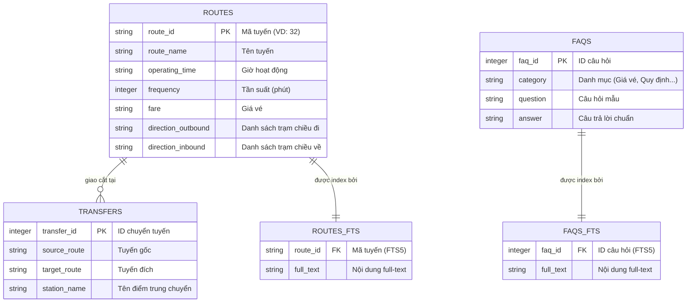

# Sơ đồ Thực thể - Liên kết (ERD)

Sơ đồ ERD mô tả cấu trúc cơ sở dữ liệu nội bộ (SQLite FTS5) để phục vụ cho các thuật toán tìm kiếm offline tại trạm.

```mermaid
erDiagram
    ROUTES {
        string route_id PK "Mã tuyến (VD: 32)"
        string route_name "Tên tuyến"
        string operating_time "Giờ hoạt động"
        integer frequency "Tần suất (phút)"
        string fare "Giá vé"
        string direction_outbound "Danh sách trạm chiều đi"
        string direction_inbound "Danh sách trạm chiều về"
    }
    
    TRANSFERS {
        integer transfer_id PK "ID chuyển tuyến"
        string source_route "Tuyến gốc"
        string target_route "Tuyến đích"
        string station_name "Tên điểm trung chuyển"
    }
    
    FAQS {
        integer faq_id PK "ID câu hỏi"
        string category "Danh mục (Giá vé, Quy định...)"
        string question "Câu hỏi mẫu"
        string answer "Câu trả lời chuẩn"
    }

    ROUTES_FTS {
        string route_id FK "Mã tuyến (FTS5)"
        string full_text "Nội dung full-text"
    }
    
    FAQS_FTS {
        integer faq_id FK "ID câu hỏi (FTS5)"
        string full_text "Nội dung full-text"
    }

    ROUTES ||--o{ TRANSFERS : "giao cắt tại"
    ROUTES ||--|| ROUTES_FTS : "được index bởi"
    FAQS ||--|| FAQS_FTS : "được index bởi"
```
