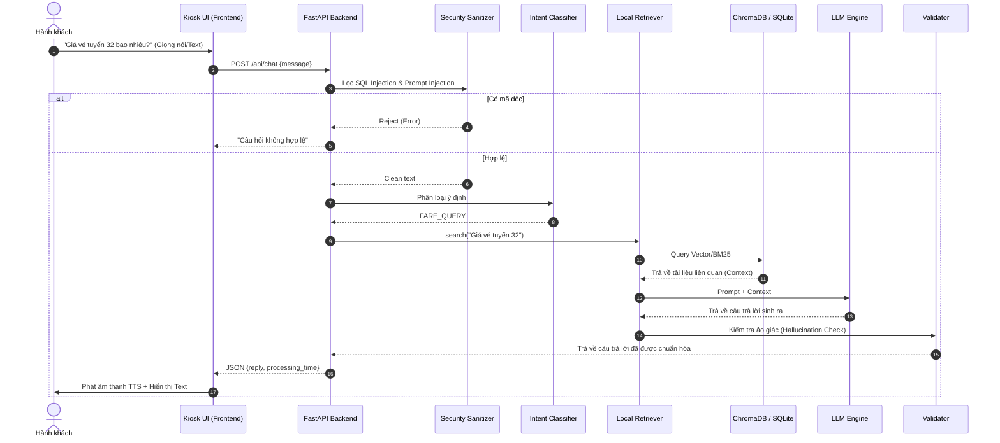

# Sơ đồ Tuần tự (Sequence Diagram)

Sơ đồ này mô tả luồng xử lý chi tiết khi người dùng đặt một câu hỏi tại trạm dừng xe buýt thông minh.

```mermaid
sequenceDiagram
    autonumber
    actor User as Hành khách
    participant Kiosk as Kiosk UI (Frontend)
    participant API as FastAPI Backend
    participant Sec as Security Sanitizer
    participant Intent as Intent Classifier
    participant RAG as Local Retriever
    participant VectorDB as ChromaDB / SQLite
    participant LLM as LLM Engine
    participant Val as Validator

    User->>Kiosk: "Giá vé tuyến 32 bao nhiêu?" (Giọng nói/Text)
    Kiosk->>API: POST /api/chat {message}
    API->>Sec: Lọc SQL Injection & Prompt Injection
    
    alt Có mã độc
        Sec-->>API: Reject (Error)
        API-->>Kiosk: "Câu hỏi không hợp lệ"
    else Hợp lệ
        Sec-->>API: Clean text
        API->>Intent: Phân loại ý định
        Intent-->>API: FARE_QUERY
        
        API->>RAG: search("Giá vé tuyến 32")
        RAG->>VectorDB: Query Vector/BM25
        VectorDB-->>RAG: Trả về tài liệu liên quan (Context)
        
        RAG->>LLM: Prompt + Context
        LLM-->>RAG: Trả về câu trả lời sinh ra
        
        RAG->>Val: Kiểm tra ảo giác (Hallucination Check)
        Val-->>API: Trả về câu trả lời đã được chuẩn hóa
        
        API-->>Kiosk: JSON {reply, processing_time}
        Kiosk->>User: Phát âm thanh TTS + Hiển thị Text
    end
```
